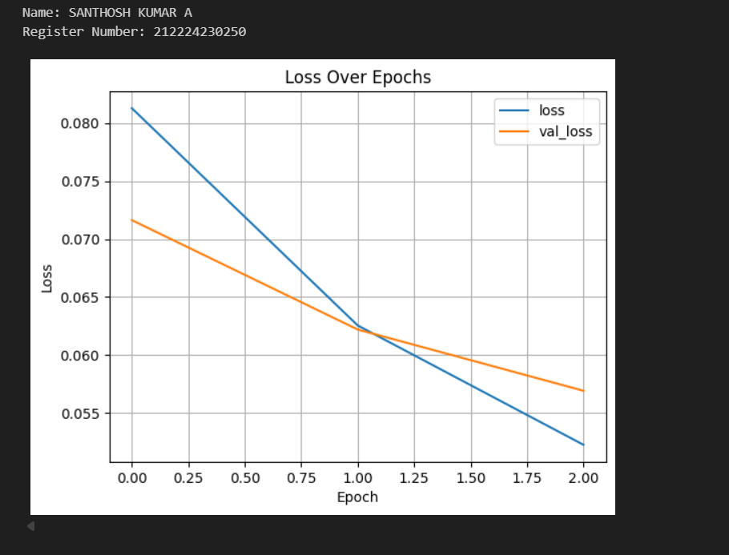
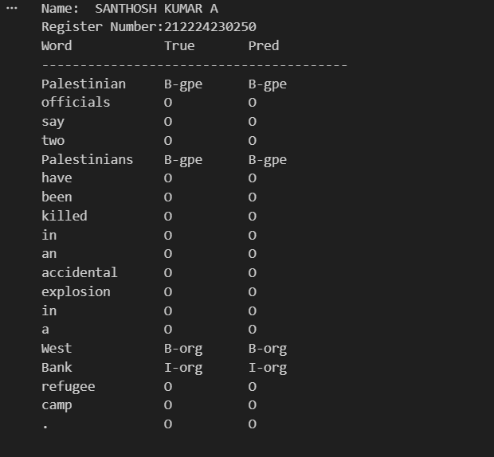

# Named Entity Recognition

## AIM

To develop an LSTM-based model for recognizing the named entities in the text.

## Problem Statement and Dataset


## DESIGN STEPS

### STEP 1:

### STEP 2:

### STEP 3:

Write your own steps

## PROGRAM
### Name: Santhosh kumar A
### Register Number:212224230250
```
class BiLSTMTagger(nn.Module):
    def __init__(self, vocab_size, tagset_size, embedding_dim=50, hidden_dim=100):
        super(BiLSTMTagger, self).__init__()
        self.embedding=nn.Embedding(vocab_size,embedding_dim)
        self.dropout=nn.Dropout(0.1)
        self.lstm=nn.LSTM(embedding_dim,hidden_dim,batch_first=True,bidirectional=True)
        self.fc=nn.Linear(hidden_dim*2,tagset_size)

    def forward(self,x):
        x=self.embedding(x)
        x=self.dropout(x)
        x,_=self.lstm(x)
        return self.fc(x)


model=BiLSTMTagger(len(word2idx)+1,len(tag2idx)).to(device)
loss_fn=nn.CrossEntropyLoss()
optimizer=torch.optim.Adam(model.parameters(),lr=0.001)


# Training and Evaluation Functions
def train_model(model,train_loader,test_loader,loss_fn,optimixer,epochs=10):
  train_losses,val_losses=[],[]
  for epoch in range(epochs):
    model.train()
    total_loss=0
    for batch in train_loader:
      input_ids=batch["input_ids"].to(device)
      labels=batch["labels"].to(device)
      optimizer.zero_grad()
      outputs=model(input_ids)
      loss=loss_fn(outputs.view(-1,len(tag2idx)),labels.view(-1))
      loss.backward()
      optimizer.step()
      total_loss+=loss.item()
    train_losses.append(total_loss)

    model.eval()
    val_loss=0
    with torch.no_grad():
      for batch in test_loader:
        input_ids=batch["input_ids"].to(device)
        labels=batch["labels"].to(device)
        outputs=model(input_ids)
        loss=loss_fn(outputs.view(-1,len(tag2idx)),labels.view(-1))
        val_loss+=loss.item()
    val_losses.append(val_loss)
    print(f"Epoch {epoch+1}: Train Loss = {total_loss:.4f}, Val Loss = {val_loss:.4f}")

  return train_losses,val_losses


```
## OUTPUT

### Training Loss, Validation Loss Vs Iteration Plot



### Sample Text Prediction


## RESULT

The BiLSTM NER model achieved good accuracy in identifying entities like persons, locations, and organizations. It showed strong performance on frequent tags, with scope for improvement on rarer ones.